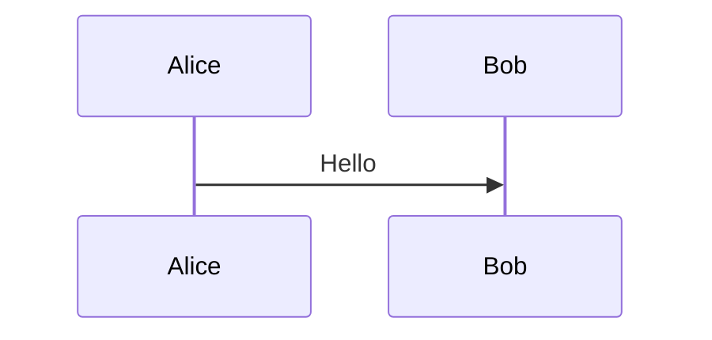

# Yandex Wiki Markup (YFM) Syntax Reference

## Inline Formatting

| Markup | Result |
|--------|--------|
| `**text**` | Bold |
| `_text_` | Italic |
| `++text++` | Underlined |
| `~~text~~` | Strikethrough |
| `##text##` | Monospace |
| `==text==` | Highlighted |
| `{color}(text)` | Colored text (gray/yellow/orange/red/green/blue/violet) |
| `text^super^` | Superscript |
| `text~sub~` | Subscript |

Combine: `**_bold italic_**`, `{orange}(~~strikethrough orange~~)`

## Headings

```
# H1
## H2
### H3
#### H4
##### H5
###### H6
##+ Collapsible H2
#### Heading with anchor {#my-anchor}
```

## Lists

Numbered (all items use `1.`, sub-items indented 3 spaces):
```
1. First
1. Second
   1. Sub-item
```

Bulleted (`*`, `-`, or `+`, sub-items indented 2 spaces):
```
* Item
  * Sub-item
```

Checkbox (blank line between items):
```
[ ] Unchecked

[x] Checked
```

## Code

Inline: `` `code` ``

Block:
````
```python
print("hello")
```
````

## Math (LaTeX)

Inline: `$e^{ix}=\cos x+i\sin x$`

Block:
```
$$
\sum_{i=1}^n x_i
$$
```

## Links

```
[text](https://url.com)
[text](/wiki/page/path)
[text](../relative/path/#anchor)
[text](#local-anchor)
[text](mailto:email@example.com)
```

Tracker issues auto-link: `TEST-123`. Escape with backticks: `` `TEST-123` ``

## Images

```


[](link_url)
```

## Tables

Wiki-style (supports multi-line cells and markup inside):
```
#|
|| **Header 1** | **Header 2** ||
|| cell 1 | cell 2 ||
|#
```

Markdown-style:
```
| H1 | H2 | H3 |
| :--- | :----: | ---: |
| left | center | right |
```

## Notes

```

Content

```

Types: `info` (blue), `warning` (orange), `alert` (red), `tip` (green).

## Collapsible Sections (Cut)

```

Hidden content here

```

## Tabs

```

- Tab 1 title
    Tab 1 content
- Tab 2 title
    Tab 2 content

```

## Blockquotes

```
> Quote
>> Nested quote
```

## Blocks and Layouts

```

Block content



Cell 1
Cell 2

```

## Table of Contents

```

```

## Page Tree

```

```

sort_by: `title`, `created_at`, `modified_at`

## Include Content from Another Page

```

```

## File Attachment

```

```

## Dynamic Table (Grid) Embed

```



```

Filter operators: `=`, `!=`, `<`, `>`, `<=`, `>=`, `~` (contains), `!~`, `between ... and ...`, `in (...)`, `not in (...)`

## Diagrams

Mermaid:
````

````

PlantUML:
```

@startuml
Bob->Alice: Hello
@enduml

```

## iframe

```
/iframe/(src="https://example.com" width="300" height="100" frameborder="0" scrolling="yes")
```

Allowed domains: yandex.ru, youtube.com, vimeo.com, vk.com, rutube.ru, coub.com, etc.

## HTML Block

```
::: html

<h1>Heading</h1>
<p>Content</p>

:::
```

## Miscellaneous

| Syntax | Effect |
|--------|--------|
| `@login` | User mention |
| `---` or `****` or `____` | Horizontal rule |
| `:emoji:` | Emoji shortcode |
| `\` before char | Escape markup |
| `[//]: # (text)` | Hidden comment (visible to editors only) |
